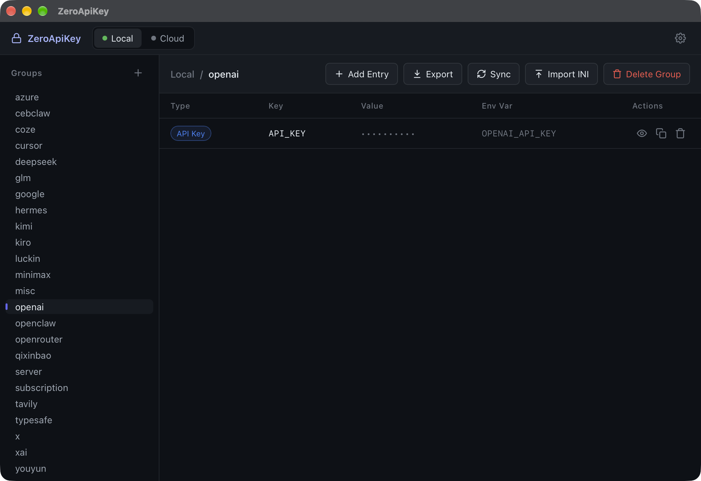
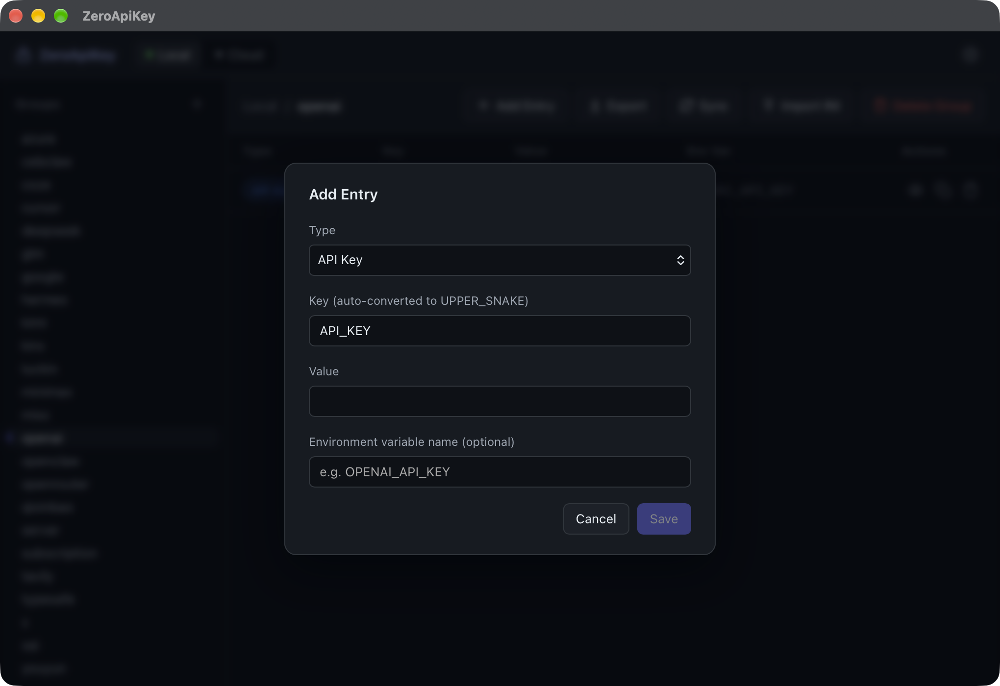
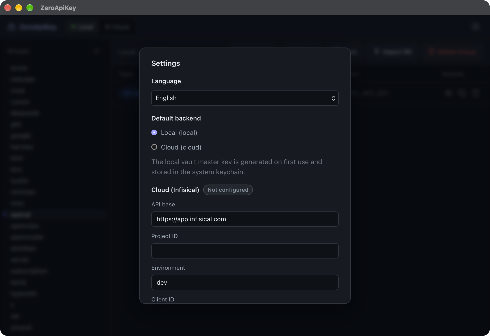

# ZeroApiKey

A local-first secret manager for macOS — desktop app **and** CLI — that replaces plaintext API keys and passwords scattered across ini files. Two interchangeable backends: an encrypted local vault, and [Infisical Cloud](https://infisical.com). Entries sync in both directions.

- **ZeroApiKey** — Tauri 2 + Preact desktop app with optional Touch ID unlock
- **zak** — full-featured CLI (same Rust crate, same data)

## Screenshots

| Main window | Add entry | Settings |
| --- | --- | --- |
|  |  |  |

## Features

- Groups (e.g. `openai`, `kimi`) containing typed entries: `api-key`, `login`, `note`
- Values are masked by default; reveal for 5 seconds or copy straight to the clipboard
- Optional environment-variable name per entry; one-click export as `export ENV=...` shell statements
- Tolerant ini import with per-entry preview and selection
- Bidirectional sync between the local vault and Infisical Cloud
- English / Chinese UI (Settings → Language), persisted locally
- Edit entries in place (pencil icon reuses the Add dialog)
- `zak get <KEY>` searches all groups by key or env var name — no group needed
- Desktop app and CLI operate on the same vault and config
- Optional GUI unlock password and Touch ID at launch; the CLI never prompts

## Architecture

```
zak (CLI) / ZeroApiKey (Tauri desktop)
  │
  ├── Store trait ─────────────────────────────┐
  │                                             │
  ├── LocalStore                      CloudStore
  │  ~/.zero-api-key/vault.enc         │  HTTPS REST API
  │  XChaCha20-Poly1305                ▼
  │  master.key (0600, SSH model)   Infisical Cloud
  │  no prompts for the CLI         Project → Environment → Folder (group) → Secret (entry)
  │
  └── sync: local ⇄ cloud, per-conflict interactive resolution
```

Unified data model shared by both backends:

```
Group (e.g. openai / deepseek / cursor)
└── Entry
      key        UPPER_SNAKE (API_KEY / USERNAME / PASSWORD / BASE_URL / NOTE / custom)
      value      stored encrypted
      type       api-key | login | note     (cloud: secretMetadata)
      env_name?  linked environment variable (cloud: secretMetadata)
```

Mapping: local Group → cloud Folder; local Entry → Secret inside that folder.

## Security model

- The local vault (`~/.zero-api-key/vault.enc`) is JSON serialized, then encrypted with XChaCha20-Poly1305.
- The 32-byte random master key is generated on first use and stored in `~/.zero-api-key/master.key` with `0600` permissions — the same filesystem-permission model as SSH private keys. Upgrading from an older build migrates the Keychain-stored key to this file once and removes it from the Keychain (that single migration read may show one final Keychain authorization prompt).
- **The CLI never prompts**: no password, no Touch ID, no Keychain authorization.
- The desktop app can require an **unlock password** at launch (Settings → Unlock password; PBKDF2-SHA256, off by default). While locked, no group or entry data is rendered, and every backend command except password verification is refused. If Touch ID unlock is also enabled (off by default), the lock screen offers a fingerprint button via LAContext device-owner verification.
- Plaintext only exists in memory; nothing is written to disk unencrypted.
- Cloud credentials (Client ID / Client Secret) are stored in the Keychain, never in the config file.

Honest limitations:

- The master key file is protected by filesystem permissions only: any process running as your user can read it — the same tradeoff as `~/.ssh/id_rsa`. The GUI unlock password gates the app's interface, not the file.

- The app is **self-signed** (local certificate `ZeroApiKey Local Dev`), not notarized. A stable signature keeps the Keychain from re-prompting on every launch, but Gatekeeper will still warn on first open of a downloaded build — right-click → Open. For personal builds this is expected; there is no Apple Developer identity behind this project.
- Even when enabled, the Touch ID gate is a pre-access check at the application layer (LAContext), not a Keychain ACL binding. It raises the bar against casual access, but a determined attacker with control of the logged-in session should be considered out of scope. Keychain ACL binding requires a proper Developer ID signature with entitlements, which is why this approach was chosen.

## Install

Download `ZeroApiKey_<version>_aarch64.dmg` from the latest release (or the `dist/` output of a local build), drag `ZeroApiKey.app` to Applications, then right-click → Open on first launch.

Build from source (requires Rust, pnpm, and the Tauri prerequisites):

```sh
pnpm install
pnpm dist        # produces dist/ZeroApiKey.app and dist/ZeroApiKey_*_aarch64.dmg
```

The CLI is built alongside the app:

```sh
cargo build --release --manifest-path src-tauri/Cargo.toml --bin zak
# binary: src-tauri/target/release/zak
```

## CLI usage

```
zak init                              # interactive setup: local / cloud / both
zak add <group> [--local|--cloud]     # interactive add (api-key / login / note)
zak get <group|KEY> [--key N] [--reveal] [--raw] [--local|--cloud]
zak list [group] [--local|--cloud]
zak rm <group> [--key N] [--local|--cloud]
zak export <group> [--local|--cloud]  # prints export ENV=..., safe to eval
zak import <file.ini> [--local|--cloud]  # tolerant parse, confirm per entry
zak sync [--to cloud|--to local]      # interactive direction if omitted
```

- `--local` / `--cloud` override the default backend; otherwise `default_mode` from `config.toml` is used.
- `zak get` resolves its argument as a group first; if no such group exists, it searches **all groups** for a matching key or env var name. A unique match prints as `group / KEY = value`; ambiguous matches (e.g. `PASSWORD` in several groups) fail with the locations — disambiguate with `zak get <group> --key <KEY>`. `--raw` (with `--reveal`) prints just the value for `$(zak get KEY --reveal --raw)` scripting.
- `zak sync` conflict policy: same key with different values → masked diff, choose keep source / keep target / skip; `--force` overwrites the target with the source.

## Cloud setup (one-time)

1. In the Infisical web UI, create a project named `zero-api-key`.
2. Project → Access Control → Machine Identities: create an identity, enable **Universal Auth**, note the Client ID / Client Secret, and grant it write access to the project.
3. Run `zak init` (or Settings in the desktop app) and enter the credentials.

## Tech stack

- `tauri` 2 — desktop shell (`src-tauri`; the `zero_api_key_lib` crate backs both the CLI and the Tauri commands)
- `preact` + `vite` + `pnpm` — frontend (`src/`)
- `clap` (derive) — CLI
- `reqwest` (blocking + rustls) — Infisical API
- `chacha20poly1305` + `rand` + `base64` — vault encryption
- `keyring` — Keychain storage for cloud credentials
- `pbkdf2` + `sha2` — GUI unlock password hashing
- `serde` / `serde_json` / `toml` — models and config
- `anyhow`, `dirs`, `dialoguer`

## License

[MIT](LICENSE) © zjl1985
